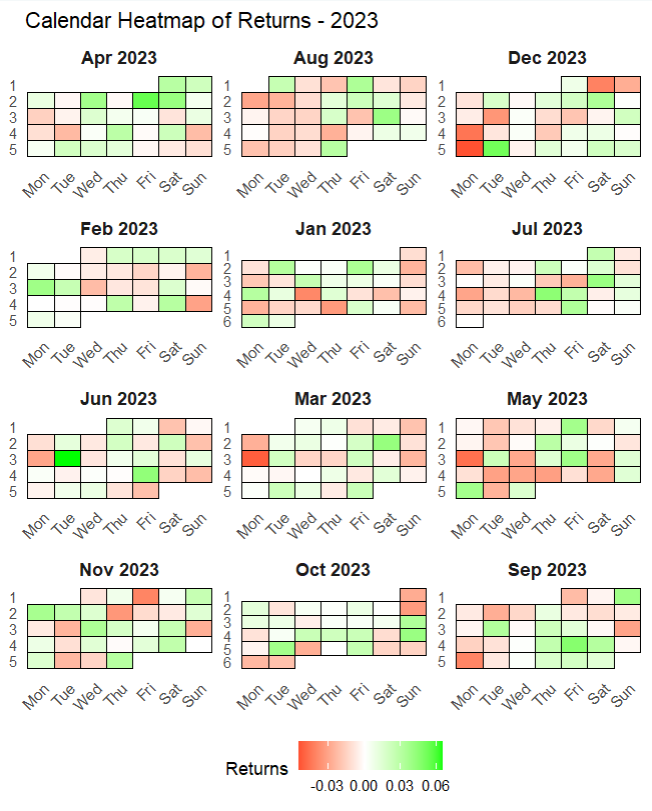
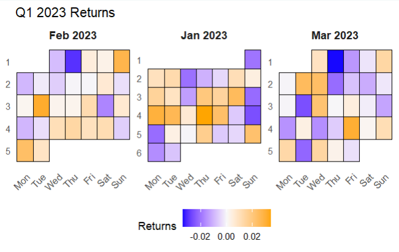

# Calendar Heatmap for Financial Returns

A flexible R function to visualize financial returns data in a calendar heatmap format. This visualization helps identify patterns across days of the week, weeks of the month, and months of the year.

## Features

- Create calendar heatmaps for any date range
- Customizable colors for positive, negative, and zero returns
- Proper visualization of weekdays and calendar structure
- Automatic handling of missing data
- Clear month and year labeling

## Example Visualizations

### Full Year Calendar Heatmap



### Quarterly Calendar Heatmap



## Installation

```r
# Install required packages if you don't have them
install.packages(c("ggplot2", "lubridate", "dplyr"))
```

## Usage

The main function is `create_calendar_heatmap()`. Here's a basic example:

```r
# Load the script
source("calender_heatmap.R")

# Create sample data
set.seed(123)
returns <- rnorm(365, mean = 0, sd = 0.02)
start_date <- "2023-01-01"
end_date <- "2023-12-31"

# Create the visualization
heatmap <- create_calendar_heatmap(
  returns = returns,
  start_date = start_date,
  end_date = end_date,
  title = "Stock Returns Calendar Heatmap"
)

# Display the plot
print(heatmap)

# Save the plot
ggsave("calendar_heatmap.png", heatmap, width = 12, height = 8, dpi = 300)
```

## Function Parameters

| Parameter | Description | Default |
|-----------|-------------|---------|
| `returns` | Numeric vector of daily returns | (required) |
| `start_date` | Start date (Date object or "YYYY-MM-DD" string) | Previous year from today |
| `end_date` | End date (Date object or "YYYY-MM-DD" string) | Today |
| `title` | Plot title | "Calendar Heatmap of Returns" |
| `low_color` | Color for negative returns | "red" |
| `mid_color` | Color for zero returns | "white" |
| `high_color` | Color for positive returns | "green" |

## Demo Function

The script includes a `demo_calendar_heatmap()` function that demonstrates two different use cases:

1. A full year of returns with simulated April trend and Monday effect
2. A quarter of returns with alternative color scheme

To run the demo:

```r
source("calender_heatmap.R")
demo_calendar_heatmap()
```

## License

This project is licensed under the MIT License - see the LICENSE file for details.
